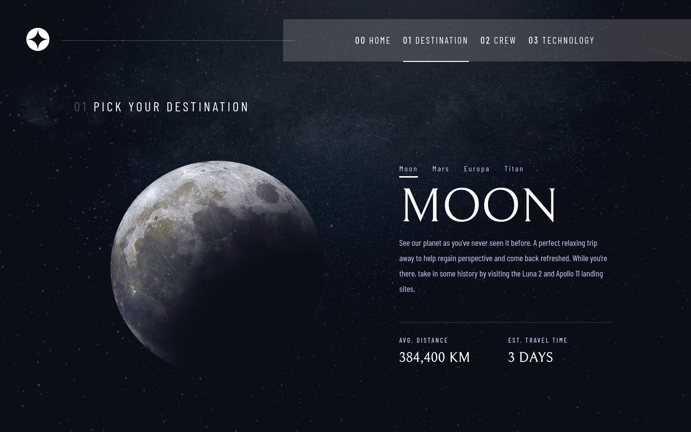
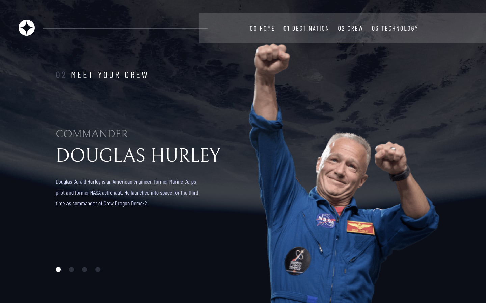
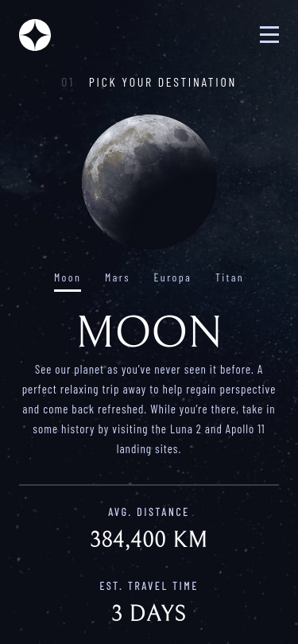
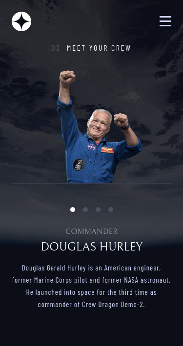

# Space-travel-multi-page
Responsive multi page about space travel from Frondendmenthor.io.
# Frontend Mentor - Space tourism website solution

This is a solution to the [Space tourism website challenge on Frontend Mentor](https://www.frontendmentor.io/challenges/space-tourism-multipage-website-gRWj1URZ3). Frontend Mentor challenges help you improve your coding skills by building realistic projects. 

## Table of contents

- [Overview](#overview)
  - [The challenge](#the-challenge)
  - [Screenshot](#screenshot)
  - [Links](#links)
  - [Built with](#built-with)
  - [What I learned](#what-i-learned)
  - [Useful resources](#useful-resources)
- [Author](#author)
- [Acknowledgments](#acknowledgments)

**Note: Delete this note and update the table of contents based on what sections you keep.**

## Overview

### The challenge

Users should be able to:

- View the optimal layout for each of the website's pages depending on their device's screen size
- See hover states for all interactive elements on the page
- View each page and be able to toggle between the tabs to see new information

### Screenshot
-Desktop Layout 1440x900

-Mobile Layout (375 x 710) 

### Links

- Solution URL: [Add solution URL here](https://www.frontendmentor.io/solutions/responsive-multi-page-r1kXyVQ45)
- Live Site URL: [Add live site URL here](https://space-travel-multipage.netlify.app/)

### Built with

- Semantic HTML5 markup
- CSS custom properties
- Flexbox
- CSS Grid
- Mobile-first workflow
- Sass

### What I learned

-Learned to use Figma
-CSS media queries
-Sass 
-Using the javascript to get data from data.Json

### Useful resources

- (https://stackoverflow.com/) Helped when i was stucked with Js :)
- (https://developer.mozilla.org/en-US/docs/Web/JavaScript) Always best help when you need some info.

## Author
- Name:Domagoj Baniček
- Website - [DomagojSk](https://github.com/Domagojsk)
- Frontend Mentor - [@DomagojSk](https://www.frontendmentor.io/profile/DomagojSk)
- Twitter - [@DomagojBane](https://www.twitter.com/DomagojBane)
- Email - domagoj.bane@gmail.com
